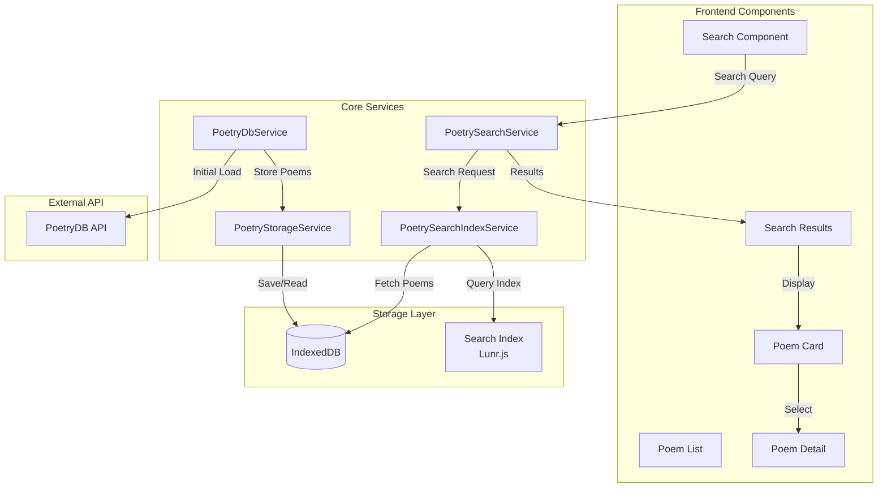
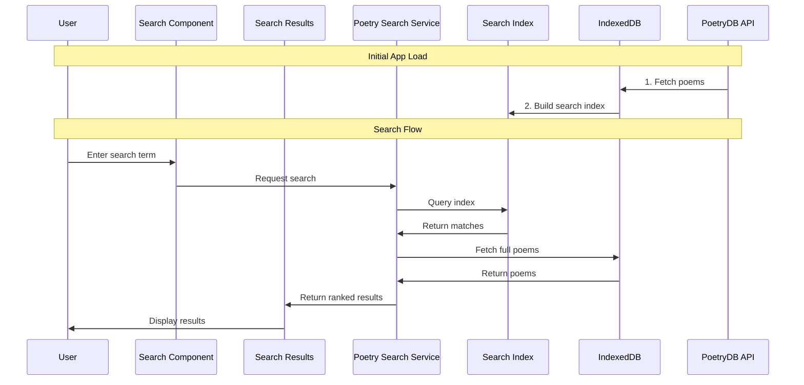

# The Poet - Architecture Documentation

## System Architecture

The following diagram shows the high-level architecture of the application:



## Search and Data Flow

This diagram illustrates the search process and data flow:



## Key Components

### Frontend Components
- **Search Component**: Main search interface with real-time suggestions
- **Search Results**: Displays ranked search results
- **Poem List**: Displays collection of poems
- **Poem Detail**: Shows full poem with metadata
- **Poem Card**: Reusable poem preview component

### Core Services
- **PoetrySearchService**: Orchestrates search operations and result ranking
- **PoetrySearchIndexService**: Manages Lunr.js search index and search optimization
- **PoetryDbService**: Handles API communication and data fetching
- **PoetryStorageService**: Manages IndexedDB operations and offline storage

### Storage Layer
- **IndexedDB**: Local storage for poems and search data
- **Lunr.js Search Index**: Optimized text search engine

## Data Flow

### Initial Load
1. Application starts and checks IndexedDB for existing data
2. If empty, PoetryDbService fetches poems from PoetryDB API
3. Poems are stored in IndexedDB via PoetryStorageService
4. Search index is built from stored poems
5. Application ready for search operations

### Search Flow
1. User enters search terms in search component
2. Query is processed to identify author names and search terms
3. Search index finds matching poems
4. Full poems are fetched from IndexedDB
5. Results are ranked based on:
   - Author match score
   - Title relevance
   - Content relevance
   - Poet prominence
6. Ranked results are displayed to user

## Search Implementation

### Search Index Configuration
```typescript
// Lunr.js field configuration
{
  title: { boost: 10 },     // Title matches
  author: { boost: 5 },     // Author field
  lines: { boost: 1 }       // Poem content
}
```

### Result Ranking System
```typescript
interface SearchResult {
  poem: Poem;
  score: number;        // Combined relevance score
  authorMatchScore: number;  // Author matching score
  titleMatchScore: number;   // Title relevance score
  contentMatchScore: number; // Content relevance score
}

// Scoring system
const AUTHOR_MATCH_SCORE = 1000000;  // Base score for author matches
const TITLE_MATCH_SCORE = 10000;     // Base score for title matches
const CONTENT_MATCH_SCORE = 100;     // Base score for content matches
```

### Performance Optimizations

1. **Search Index Optimization**
   - Efficient field boosting
   - Optimized token processing
   - Fast index lookups

2. **Storage Strategy**
   - IndexedDB for offline capability
   - Efficient data structure for quick retrieval
   - Optimized storage patterns

3. **Component Design**
   - Lazy loading of poem details
   - Efficient result rendering
   - Optimized change detection

## Angular Architecture

### Module Structure
- Standalone components for better tree-shaking
- Feature-based organization
- Shared services for state management

### SSR Implementation
- Angular Universal for server-side rendering
- Initial state transfer
- SEO optimization

### Performance Features
- Lazy loading routes
- Preloading strategies
- Optimized bundle size
- Efficient change detection

## Development Guidelines

### Code Organization
- Feature-based directory structure
- Clear separation of concerns
- Consistent naming conventions

### Best Practices
- Strong typing with TypeScript
- Reactive programming with RxJS
- Component composition
- Service abstraction

### Testing Strategy
- Unit tests for services
- Component testing
- E2E testing for critical paths 