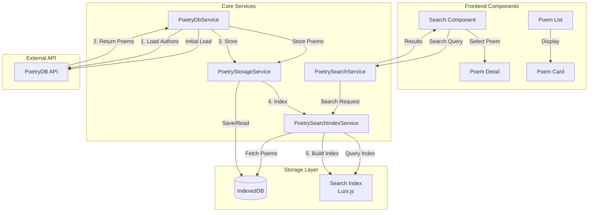
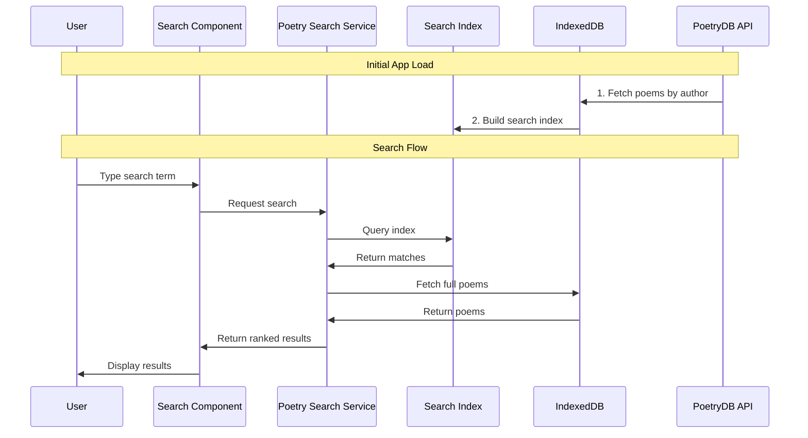
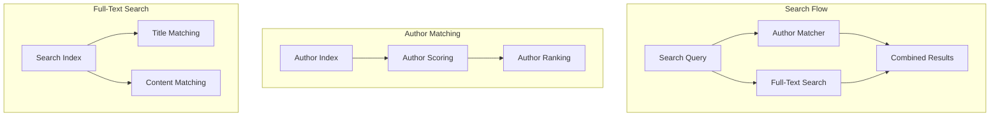

# The Poet - Architecture Documentation

## System Architecture

The following diagram shows the high-level architecture of the application:



## Search and Data Flow

This diagram illustrates the search process and data flow:



## Key Components

### Frontend Components
- **Search Component**: Main search interface with autocomplete
- **Poem List**: Displays search results
- **Poem Detail**: Shows full poem with formatting
- **Poem Card**: Reusable poem display component

### Core Services
- **PoetrySearchService**: Orchestrates search operations
- **PoetrySearchIndexService**: Manages Lunr.js search index
- **PoetryDbService**: Handles API communication
- **PoetryStorageService**: Manages IndexedDB operations

### Storage Layer
- **IndexedDB**: Local storage for poems
- **Lunr.js Search Index**: Fast text search capabilities

## Data Flow

### Initial Load
1. PoetryDbService fetches poems from PoetryDB API
2. Poems are stored in IndexedDB via PoetryStorageService
3. Search index is built from stored poems

### Search Flow
1. User types in search component
2. Query goes through search service
3. Search index finds matches
4. Full poems are fetched from IndexedDB
5. Results are ranked and displayed

## Key Features
- Offline-first architecture with IndexedDB
- Fast search with pre-built index
- Progressive loading of poetry data
- Ranked search results by poet popularity 

## Search Implementation Details

### Search Architecture

The search system uses a multi-stage approach combining author matching and full-text search:



### Search Components

#### 1. Author Matching System
```typescript
// Scoring system for author matches
interface AuthorMatch {
  author: string;
  score: number;      // Combined relevance score
  baseRanking: number; // Poet's prominence ranking
}

// Score calculation
- Consecutive name matches: 100,000 points
- Individual word matches: 10,000 points per word
- Complete name match bonus: 500,000 points
- Author prominence bonus: (1,000,000 - baseRanking)
```

#### 2. Search Index Configuration
```typescript
// Lunr.js field configuration
{
  exactTitle: { boost: 25 },    // Exact title matches
  titleStart: { boost: 20 },    // Words at start of title
  title: { boost: 15 },         // General title matches
  author: { boost: 10 },        // Author field
  lines: { boost: 1 }           // Poem content
}
```

#### 3. Result Ranking System
```typescript
// Final result scoring
- Author match: 1,000,000 points
- Title match: 10,000 points
- Content match: 100 points
- Author prominence: Used as tiebreaker
```

### Search Process

1. **Query Analysis**
   - Split search terms
   - Identify potential author names
   - Extract non-author search terms

2. **Author Matching**
   ```typescript
   // Example: "winter robert burns"
   searchTerms = ["winter", "robert", "burns"]
   authorMatches = findMatchingAuthors(searchTerms)
   // Returns: ["Robert Burns"]
   ```

3. **Term Processing**
   - Remove author name terms
   - Use remaining terms for content search
   ```typescript
   // After author match
   remainingTerms = ["winter"]
   ```

4. **Parallel Search**
   - Search author's poems
   - Search all poems for remaining terms
   ```typescript
   forkJoin([
     searchAuthorPoems(authorMatches),
     searchAllPoems(remainingTerms)
   ])
   ```

5. **Result Combination**
   - Combine author poems and text search results
   - Apply scoring system
   - Remove duplicates
   - Sort by final score

### Performance Optimizations

1. **Background Prefetching**
   - Prefetch poems for authors starting with typed letter
   - Limit concurrent requests to 2
   - Cache prefetched results

2. **Index Optimizations**
   - Remove stemming for exact matches
   - Add word pairs for phrase matching
   - Index title variations for better matching

3. **Caching Strategy**
   ```typescript
   // Caching levels
   - In-memory author index
   - IndexedDB for poem storage
   - Search index persistence
   ```

### Search Examples

```typescript
// Example 1: "winter robert burns"
- Author match: "Robert Burns" (score: 1,000,000)
- Term match: "winter" in title (score: 10,000)
Final order: Robert Burns' winter poems first

// Example 2: "sonnet shakespeare"
- Author match: "William Shakespeare"
- Term match: "sonnet" in title
Result: Shakespeare's sonnets ranked first

// Example 3: "love"
- No author match
- Full text search only
- Results ranked by:
  1. Title matches
  2. Author prominence
  3. Content relevance
``` 